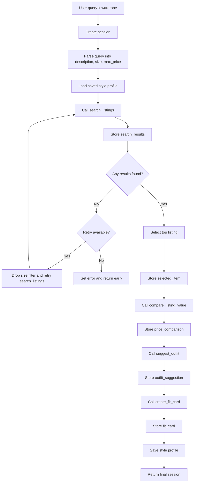

# FitFindr — planning.md

## Tools

### Tool 1: search_listings

**What it does:**  
This tool searches the mock thrift listings dataset for items that match the user’s requested description, optional size, and optional maximum price. It filters the dataset and ranks the remaining items by relevance using keyword overlap across listing text fields.

**Input parameters:**  
- `description` (`str`): Keywords describing what the user is looking for, such as `"vintage graphic tee"`.
- `size` (`str | None`): Optional size filter. Matching is case-insensitive, and partial matches are allowed, such as `"M"` matching `"S/M"`.
- `max_price` (`float | None`): Optional maximum price filter. Only items at or below this price are kept.

**What it returns:**  
A `list[dict]` of listing dictionaries sorted by relevance, with the best match first. Each listing dictionary contains:
- `id` (`str`)
- `title` (`str`)
- `description` (`str`)
- `category` (`str`) — one of `tops`, `bottoms`, `outerwear`, `shoes`, or `accessories`
- `style_tags` (`list[str]`)
- `size` (`str`)
- `condition` (`str`) — `excellent`, `good`, or `fair`
- `price` (`float`)
- `colors` (`list[str]`)
- `brand` (`str | None`)
- `platform` (`str`) — `depop`, `thredUp`, or `poshmark`

**What happens if it fails or returns nothing:**  
This tool does not raise an exception when no matches are found. It returns an empty list. In the base workflow, the agent stops and returns a helpful no-results message. In the implemented stretch workflow, the agent retries once when `search_listings` returns no results by dropping the size filter. It only stops if the retry also returns no matches.

**Implementation plan:**  
1. Load all listings with `load_listings()`.
2. Normalize the query text by lowercasing and splitting into keywords.
3. Filter by `max_price` if provided.
4. Filter by `size` if provided.
5. Score each remaining listing by keyword overlap across `title`, `description`, `category`, `style_tags`, `colors`, and `brand`.
6. Drop items with a score of `0`.
7. Sort matches by score descending, then by lower price when scores tie.
8. Return the sorted listing dictionaries, or `[]` if none match.

---

### Tool 2: suggest_outfit

**What it does:**  
This tool takes one thrifted item and the user’s wardrobe, then generates 1–2 outfit suggestions. If wardrobe items are available, it uses them to create specific outfits. If the wardrobe is empty, it gives general styling advice instead.

**Input parameters:**  
- `new_item` (`dict`): A listing dictionary representing the thrifted item returned from `search_listings`.
- `wardrobe` (`dict`): A wardrobe dictionary with an `items` key containing a list of wardrobe item dictionaries.

**What it returns:**  
A non-empty `str` containing outfit suggestions. The string may include:
- one or two outfit ideas
- references to specific wardrobe pieces if available
- overall style or vibe guidance
- general advice if the wardrobe is empty

**What happens if it fails or returns nothing:**  
If `wardrobe["items"]` is empty, the tool does not fail. Instead, it returns general styling advice for the thrifted item. If the LLM call fails, the tool returns a simple fallback suggestion rather than an empty string. If `new_item` is missing, it returns a descriptive error string.

**Implementation plan:**  
1. Check whether `new_item` exists.
2. Check whether `wardrobe["items"]` is empty.
3. If empty, prompt the LLM for general styling advice for the new item.
4. If wardrobe items exist, format the wardrobe plus `new_item` into a prompt.
5. Ask the LLM for 1–2 outfit suggestions using named wardrobe pieces.
6. If the LLM call fails, return a deterministic fallback suggestion.
7. Return the result as a string.

---

### Tool 3: create_fit_card

**What it does:**  
This tool generates a short, shareable fit card caption from the outfit suggestion and the thrifted item. The output is written like a social caption rather than a product listing.

**Input parameters:**  
- `outfit` (`str`): The outfit suggestion returned by `suggest_outfit`.
- `new_item` (`dict`): The listing dictionary for the thrifted item.

**What it returns:**  
A `str` containing a 2–4 sentence caption. The caption should:
- sound casual and authentic
- mention the item name, price, and platform naturally
- describe the outfit vibe clearly
- vary slightly across runs for different inputs

**What happens if it fails or returns nothing:**  
If `outfit` is empty, missing, or only whitespace, the tool returns a descriptive error string instead of raising an exception. If the LLM call fails, it returns a deterministic fallback caption. If `new_item` is missing some fields, the tool still produces the best caption it can using available data.

**Implementation plan:**  
1. Check whether `outfit` is empty or whitespace-only.
2. If so, return a descriptive error string.
3. Otherwise, build a prompt using the thrifted item details and outfit text.
4. Call the LLM with a slightly higher temperature to create a more natural caption.
5. If the LLM call fails, return a deterministic fallback caption.
6. Return the caption string.

---

### Additional Tools

### Tool 4: compare_listing_value

**What it does:**  
This stretch tool compares the selected listing to similar items in the full listings dataset and estimates whether the price looks low, fair, or high for that item type.

**Input parameters:**  
- `selected_item` (`dict`): The listing selected by the agent from `search_listings`.
- `all_listings` (`list[dict]`): The full listings dataset used to find comparable items by category plus overlapping style tags, colors, or platform.

**What it returns:**  
A `dict` containing:
- `price_assessment` (`str`): `"good deal"`, `"fair price"`, or `"overpriced"`
- `reasoning` (`str`): A short explanation based on comparable prices
- `comparable_count` (`int`)
- `average_comparable_price` (`float | None`)

**What happens if it fails or returns nothing:**  
If there are too few comparable items or the selected item has no valid numeric price, the tool returns an `"unknown"` assessment and the agent continues normally.

---

### Tool 5: save_style_profile

**What it does:**  
This stretch tool stores lightweight style preferences discovered during one interaction so they can be reused in future runs.

**Input parameters:**  
- `user_id` (`str`): Identifier for the user session or test user
- `preferences` (`dict`): Extracted style preferences such as liked style tags, liked colors, last query, and last category

**What it returns:**  
A `dict` containing:
- `saved` (`bool`)
- `stored_preferences` (`dict`)

**What happens if it fails or returns nothing:**  
If the profile cannot be saved, the agent continues normally for the current interaction but does not reuse preferences in future runs.

---

### Tool 6: get_style_profile

**What it does:**  
This stretch tool retrieves previously saved style preferences so the agent can personalize future runs.

**Input parameters:**  
- `user_id` (`str`): Identifier for the user session or test user

**What it returns:**  
A `dict` containing saved style preferences, or an empty dictionary if no profile exists.

**What happens if it fails or returns nothing:**  
If no style profile exists, the agent continues using only the current query and wardrobe input.

---

## Planning Loop

**How does your agent decide which tool to call next?**  
The agent follows a state-driven planning loop. It checks the current session state after each step and decides whether to continue, retry, branch to a fallback path, or stop.

1. The agent starts by creating a new session dictionary for the interaction.
2. It parses the natural-language query into structured search parameters such as `description`, `size`, and `max_price`.
3. If stretch memory is enabled, the agent loads any saved style profile into the session before searching.
4. If no candidate item has been found yet, the agent calls `search_listings`.
5. If `search_listings` returns one or more results, the agent stores the top match as `selected_item`.
6. If `search_listings` returns an empty list, the base workflow stops with a helpful no-results message. In the implemented stretch workflow, the agent retries once by dropping the size filter, stores `retry_count = 1` and `retry_reason = "no_results_with_size"`, and only stops if the retry also returns no matches.
7. After an item is selected, the agent optionally calls `compare_listing_value` using the selected item and the full listings dataset.
8. The agent then calls `suggest_outfit` using the selected item and the current wardrobe state.
9. If `suggest_outfit` returns a non-empty string, the agent passes that exact string into `create_fit_card`.
10. If `suggest_outfit` falls back to general styling advice because the wardrobe is empty, the agent still passes that advice into `create_fit_card`.
11. If stretch memory is enabled, the agent saves lightweight style preferences from the selected item and query for future runs.
12. The loop ends when the final fit card is created or when a terminal failure state is reached, such as no results after retry.

---

## State Management

**How does information from one tool get passed to the next?**  
The agent stores all interaction data in a shared session dictionary. This session dictionary is the source of truth for the current run.

Tracked session fields include:
- `query` (`str`): Original user query
- `parsed` (`dict`): Extracted query parameters such as `description`, `size`, and `max_price`
- `search_results` (`list[dict]`): Output from `search_listings`
- `selected_item` (`dict | None`): The top listing selected from `search_results`
- `wardrobe` (`dict`): User wardrobe input
- `outfit_suggestion` (`str | None`): Output from `suggest_outfit`
- `fit_card` (`str | None`): Output from `create_fit_card`
- `price_comparison` (`dict | None`): Output from `compare_listing_value`, if used
- `style_profile` (`dict`): Saved or loaded user style preferences
- `retry_count` (`int`): Number of retry attempts used for search fallback
- `retry_reason` (`str | None`): Explanation of why the retry was used
- `error` (`str | None`): Error message if the interaction ends early

**Flow of state:**  
1. `search_listings` reads from `session["parsed"]` and writes to `session["search_results"]`.  
2. The top result from `session["search_results"]` is stored as `session["selected_item"]`.  
3. `compare_listing_value` reads `session["selected_item"]` and the full listings dataset, then writes to `session["price_comparison"]`.  
4. `suggest_outfit` reads `session["selected_item"]` and `session["wardrobe"]`, then writes to `session["outfit_suggestion"]`.  
5. `create_fit_card` reads `session["outfit_suggestion"]` and `session["selected_item"]`, then writes to `session["fit_card"]`.  
6. Optional stretch tools read from and write to `session["style_profile"]`.

This state flow ensures that the selected item moves into `suggest_outfit` without user re-entry and that the outfit suggestion moves into `create_fit_card` without user re-entry.

---

## Error Handling

| Tool | Failure mode | Agent response |
|------|-------------|----------------|
| `search_listings` | No results match the user query | Return `[]`; in the base workflow the agent returns a clear no-results message, and in the stretch workflow it retries once by removing the size filter before stopping. |
| `suggest_outfit` | `new_item` is missing | Return a descriptive error string explaining that no thrifted item was provided. |
| `suggest_outfit` | Wardrobe is empty | Return general styling advice for the thrifted item instead of failing. |
| `suggest_outfit` | LLM call fails | Return a simple fallback outfit suggestion using provided item and wardrobe data. |
| `create_fit_card` | Outfit input is empty or missing | Return a descriptive error string explaining that no outfit text was available to convert into a fit card. |
| `create_fit_card` | LLM call fails | Return a deterministic fallback caption. |
| `create_fit_card` | Missing item fields | Create the best possible caption from available fields instead of crashing. |
| `compare_listing_value` | Too few comparable listings or invalid price | Return an `"unknown"` assessment and continue without blocking the rest of the workflow. |
| `save_style_profile` | Preferences cannot be stored | Continue the current interaction without persistent memory. |
| `get_style_profile` | No saved profile exists | Continue using only the current query and wardrobe data. |

---

## Architecture

---

## AI Tool Plan

**Milestone 3 — Individual tool implementations:**  
I will use Perplexity to help implement and refine each standalone tool before wiring them into the agent loop.

- For `search_listings`, I will provide the function signature, docstring, dataset fields, and required ranking behavior from the Tool 1 spec. I expect a Python implementation that filters, scores, sorts, and returns listing dictionaries. I will verify it using several test searches, including one that returns no results.
- For `suggest_outfit`, I will provide the Tool 2 spec plus sample `new_item` and `wardrobe` inputs. I expect a function that returns a non-empty outfit string and behaves differently when the wardrobe is empty. I will verify it with both a wardrobe-based case and an empty-wardrobe case.
- For `create_fit_card`, I will provide the Tool 3 spec, style requirements for the caption, and sample inputs. I expect a function that returns a 2–4 sentence caption string and returns a descriptive error string for empty outfit input. I will verify it with normal and failure-case inputs.
- For `compare_listing_value`, I will provide example listing outputs and ask for a function that compares the selected item’s price against similar items in the full dataset. I will verify it by checking that clearly cheap items are labeled as good deals and clearly expensive items are flagged as overpriced.
- For `save_style_profile` and `get_style_profile`, I will provide the desired storage format and example preference data. I expect simple persistence logic that can save and reload style preferences across two test interactions.

**Milestone 4 — Planning loop and state management:**  
I will provide the Planning Loop, State Management, Error Handling, and Architecture sections to Perplexity and ask it to generate the orchestration logic in `agent.py`. I expect it to produce a controller that:
- reads the user query
- stores intermediate results in session state
- conditionally calls the three required tools
- branches into retry and fallback paths when needed
- optionally calls stretch tools for price comparison and memory
- returns either a fit card or a user-facing failure response

I will verify this by testing:
1. a happy-path interaction using all three required tools
2. a no-results query that triggers retry
3. an empty-wardrobe query that changes the outfit behavior
4. a failure case where `create_fit_card` receives empty outfit text
5. two back-to-back interactions showing saved style preferences reloaded in the second run

---

## A Complete Interaction (Step by Step)

**Example user query:**  
"I'm looking for a vintage graphic tee under $30. What's out there and how would I style it?"

**Step 1:**  
The agent creates a new session and parses the query into structured search parameters:
- `description = "vintage graphic tee"`
- `size = None`
- `max_price = 30.0`

The wardrobe input is stored separately in session and will later be used by `suggest_outfit`.

**Step 2:**  
If style memory is enabled, the agent checks for a saved style profile and stores it in the session.

**Step 3:**  
The agent calls:

`search_listings("vintage graphic tee", None, 30.0)`

The returned results are stored in `search_results`.

**Step 4:**  
If results are found, the top listing is saved as `selected_item`. If no results are found, the base workflow ends with an error message. In the implemented stretch workflow, the agent retries once with `size=None` before ending.

**Step 5:**  
If the price comparison stretch feature is enabled, the agent calls:

`compare_listing_value(selected_item, all_listings)`

and stores the result in `price_comparison`.

**Step 6:**  
The agent calls:

`suggest_outfit(selected_item, wardrobe)`

If the wardrobe contains matching pieces, the tool returns specific outfit ideas. If the wardrobe is empty, it returns general styling advice instead.

**Step 7:**  
The returned outfit string is stored as `outfit_suggestion`. The agent then calls:

`create_fit_card(outfit_suggestion, selected_item)`

**Step 8:**  
The returned caption is stored as `fit_card`.

**Step 9:**  
If style memory is enabled, the agent extracts lightweight preferences from the selected item and query, then saves them for future runs.

**Final output to user:**  
The user sees:
- the best thrifted item match
- the outfit suggestion
- the fit card caption
- and, if enabled, a price assessment showing whether the item looks like a good deal